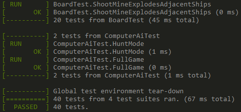

# Advanced Programming 2 - Battleships
##  1. Challenge Outline
### Summary & Overview
The battleships challenge is to create a command-line version of the
famous battleships game. The grid is printed on the console, using
numbers to indicate the rows, letters to indicate the columns (A - Z,
then AA - ZZ, etc. for longer column grids), and also letters to
represent ships on the board (for example, a submarine is 3 S letters
in a row).

The game should load the board size and the types of ships from a
configuration file. For example, here is the default configuration:
```
Board: 10x10
Boat: Carrier, 5
Boat: Battleship, 4
Boat: Destroyer, 3
Boat: Submarine, 3
Boat: Patrol Boat, 2
```
The board is limited to a minimum size of 5x5 and a max size of 80x80.

Custom boats can be specified by listing `Boat: {name}, {size}`
statements in the configuration file. The first letter of the boat is
used when representing it on the grid. Due to logical constraints, a
boat can't exceed the width or height of the board, or be of size less
than 1.

Boats with duplicate starting letters will issue an error. Any errors
detected with the configuration file will force the user to load a
default configuration.

An example board based on the above configuration looks like this:
```
   A B C D E F G H I J
1                     
2  C               D  
3  C               D  
4  C               D  
5  C                  
6  C       B B B B    
7                     
8                     
9      S S S       P  
10                 P  
```

In a standard game, there will be two players. Each player can see
their own board (the player's board) and the enemy's board (the target
board), which should not display the ship positions.

The game must also include a computer player for single-player
gameplay.

Furthermore, players must be able to place ships, have ships
auto-placed, target specific locations on the board, see hits and
misses, support a turn-based play system, and (for merit and
distinction) support the "salvo" game mode (where each ship can fire a
torpedo in each round) and the "hidden mines" game mode (where hitting
a mine will cause an explosion in adjacent fields).

### Proposed Solution
My proposed solution consists of four parts:
1. Configuration parser
   
   The configuration parser will read configuration files and create
   a configuration object from these.
1. Board
   
   The board will contain all of the logic for placing and targeting
   ships. Furthermore, when mines are implemented, it will also hold
   mines. It will perform logic checks for board out of bounds
   placement and placing ships on top of eachother. Lastly, it will
   also be able to auto-place ships.
1. Board renderer
   
   The board renderer is a component that takes a board and then
   renders this as a string to print to the console. Various settings
   can be applied to the board renderer, which will allow us to print
   all possible variations of a board. For example, the renderer can
   be put into a TARGET state, where you can only see where you have
   hit and not the enemy's actual ship locations. If put into a SELF
   state, you can see all of your ships and where they have been hit.
1. Main

   The main component will contain user interaction (input/output),
   initialization of each of the other components, and commands which
   trigger the gameplay.
   
   The main component will:
   1. Use the configuration parser to read a file, and report any
      errors. If there are errors, the default file will be loaded
      instead.
   2. Create a board given the configuration, and forward any user
      commands (e.g. place ship) to the board, which will trigger
      the remaining logic.
   3. Use the board renderer to print the user's board on each turn.

### UML Diagram


### Initial Working Plan
#### Overall Approach
The overall approach with this project is to test each component.
For this purpose, the GoogleTest library is included in this project
(cloned from https://github.com/google/googletest into
`lib/googletest`). I will use make to compile the program during
development, hence the `CMakeLists.txt` files in each source directory.

I will use a waterfall approach. Each component will be written and
tested independently, and then they will all be assembled in the main
component at the end.

#### Development Strategy
Each component will be developed independently and tested. For this
purpose, there exist four test files in the `test/` directory that
can be inspected:
1. `configuration-parser-test.cc`
1. `board-renderer-test.cc`
1. `board-test.cc`

The remaining main component will be tested manually, as given the
rest of the components work correctly proved by tests, the main
component is a minimum amount of work. Testing the main component
would mean that logic is tested twice, which is not useful in a real
project because you end up maintaining twice as many tests for no added
value.

#### Approach to Quality
Quality will be ensured by writing a test suite that covers a
reasonable variety of situations. I will test standard inputs,
borderline but valid inputs, and invalid inputs.

For the main component, a final run of the game will be done prior
to submission.

### Decomposition into Epics
Based on the above discussion, each component will be an epic:
- Epic 1: configuration parser
- Epic 2: board renderer
- Epic 3: board
- Epic 4: main component

Epics 1 - 3 may be completed in any order. Epic 4 relies on epics
1 - 3, so it can be developed alongside but not before any of the other
epics.

### Object-Oriented Design Ideas and Phased Breakdown
Epics 1 - 3 will be classes. They will use state for logic and
configuration. For example, the board renderer will have state that
dictates how the board is rendered (as a target board or a self board).

Each component may introduce as many further classes as required to
make it work neatly. For example, the board class may (or may not)
need a class to store boats based on their locations. These further
classes will be broken down as I go along, as they are difficult
to plan beforehand.

Epic 4 will be the main file, which will contain the main method
along with any other helper methods, and will instantiate each of
the other epics, and provide their dependencies. It will also deal
with user input and output.

## 2. Development
### Adoption and Use of Good Standards
Good standards are standards which decrease development time or
increase code correctness.

For example, C++ has many features which result in
"undefined behaviour". Undefined behaviour is code which may behave
differently on different compiler platforms. A good style guide
should aim to minimise or eliminate undefined behaviour.

Furthermore, to decrease development time, good standards should
produce code that is quickly readable. Developers shouldn't have to
spend time figuring out what an expression or piece of code does;
they should just be able to read it and understand.

Lastly, to decrease development time again, good standards should
include the most efficient way to structure common code elements
so that developers don't have to spend time thinking about them,
yet the code will automatically be good. One example of this is
that functions should only do one thing. This will allow functions
to be composed in the future, which will save development time.

Decreasing development time benefits project owners because the
product they want will be complete quicker. Colleagues will spend
less time battling with difficult code, which increases overall
development satisfaction. End-users will get their product sooner.

As for code correctness, project owners and end-users benefit
because the code they received is less likely to contain
corner-case bugs which weren't discovered during testing.
Colleagues benefit as there will be less subtle bugs during
development, which are annoying and hard to find.

Good standards may be defined in many ways, but a surefire way
to do so is to follow practices that are implemented by successful
engineers. One such example is the
[Google C++ style guide](https://google.github.io/styleguide/cppguide.html).

For the majority of the project, when unsure I will be following
practices defined in this document as close as possible. Sometimes,
I have chosen personal practises that are similar but more
preferential than the Google document. For example, that document
outlines that header guards should be in the format `PATH_TO_FILE_H_`,
yet my header guards are in the format `PATH_TO_FILE_H`. This is
hardly different and has the same effect, I just prefer it without
the trailing underscore.

Furthermore, I have an additional standard that may appear surprising.
I prefer to write self-explanatory code rather than writing many comments.
Whilst I understand that code should be understandable, I think that
people who read code should be developers, therefore they should know
what code means when they read it. Adding too many comments to code
can increase development time because developers have to code around
comments that they don't read or update. Therefore I define it a good
standard to include more explanatory code and less comments.

Below is an example of using explanatory code rather than comments
from the project:
```cpp
// A mine was discovered, shoot all of the locations around it
if (mine_locations.find(location) != mine_locations.end()) {
  Shoot(Location(location.x, location.y - 1)); // above
  Shoot(Location(location.x, location.y + 1)); // below
  Shoot(Location(location.x - 1, location.y)); // left
  Shoot(Location(location.x +  1, location.y)); // right
  Shoot(Location(location.x - 1, location.y - 1)); // above_left
  Shoot(Location(location.x + 1, location.y - 1)); // above_right
  Shoot(Location(location.x - 1, location.y + 1)); // below_left
  Shoot(Location(location.x + 1, location.y + 1)); // below_right
}
```

The above code was re-written in an entirely self-explanatory way:
```cpp
if (IsMine(location)) {
  const Location above(location.x, location.y - 1);
  const Location below(location.x, location.y + 1);
  const Location left(location.x - 1, location.y);
  const Location right(location.x +  1, location.y);
  const Location above_left(location.x - 1, location.y - 1);
  const Location above_right(location.x + 1, location.y - 1);
  const Location below_left(location.x - 1, location.y + 1);
  const Location below_right(location.x + 1, location.y + 1);

  Shoot(above);
  Shoot(below);
  Shoot(left);
  Shoot(right);
  Shoot(above_left);
  Shoot(above_right);
  Shoot(below_left);
  Shoot(below_right);
}
```

### Phase 1 Development (Configuration Parser)
#### Task Overview
This is the configuration parser epic. The intention was to have a
configuration parser which can handle many different varieties of
input and attempt to decode them as long as they contain the vital
information. If decoding is not possible, errors should be reported
such that the UI module can display them to the user.

#### Completion and Technical Debt
This phase completed the configuration parser to its full extent.
It's possible that some issues were missed (such as 0-length ship
validation). However, to enable testing, the configuration parser
only accepts strings. This means that file reading will have to be
written and debugged in the UI module. The code is well-written and
is unlikely to require refactorings beyond simple logic changes.

### Phase 2 Development (Board)
#### Task Overview
This is the board epic. The intention here was to have a board that
can have actions performed on it (e.g. `AddBoat`, `Shoot`) that does
validations against invalid actions (e.g. you can't place two boats
on top of each other). These functions return `true` or `false` to
show whether the action can be performed.

#### Completion and Technical Debt
This phase mostly completed the board epic, however some features
from the merit and distinction sections are missing, such as placing
mines. These will be added later.

The board was extensively tested with various configurations and
therefore has robust logic validations. The code is well-written
and unlikely to require refactorings excluding the additional
logic that must be added.

### Phase 3 Development (Board Renderer)
#### Task Overview
This is the board renderer epic. The intention was to have a class
which takes a board and then queries the board's state (e.g.
`IsHit(location)`, `GetBoat(location)`, `IsMine(location)`) and
then renders this as a grid string that can be printed to the
command line. the board renderer needs two modes, a `SELF` mode
and a `TARGET` mode, which specify who the board should render for.

For example, in the self mode, the board is being rendered to the
player, so they can see their own ships, as well as where they've
been shot.

However, in the target mode, the board is being rendered to the
opponent, so only the shots that have been fired and whether they
were a hit/miss should be displayed.

#### Completion and Technical Debt
This board renderer is complete, however does not yet take account
of mines, since the board does not implement this yet. Large
refactorings will have to take place when this happens, as mines
will need to shift the column headers for which they are rendered.

Here are examples of the tests written so far (available in
`test/board-renderer-test.cc`):
```cpp
TEST(BoardRendererTest, SelfBoardRender) {
  Board board(10, 10);
  BoardRenderer board_renderer(board);
  board.AddBoat(Boat(ShipType{ "Carrier", 5 }, Orientation::Vertical), BoardLetterIndex(A, 2));
  board.AddBoat(Boat(ShipType{ "Destroyer", 3 }, Orientation::Vertical), BoardLetterIndex(I, 2));
  board.AddBoat(Boat(ShipType{ "Battleship", 4 }, Orientation::Horizontal), BoardLetterIndex(E, 6));
  board.AddBoat(Boat(ShipType{ "Submarine", 3 }, Orientation::Horizontal), BoardLetterIndex(C, 9));
  board.AddBoat(Boat(ShipType{ "Patrol Boat", 2 }, Orientation::Vertical), BoardLetterIndex(I, 9));

  const std::string render = board_renderer.Render();

  EXPECT_EQ("   A B C D E F G H I J\n"
            "1                     \n"
            "2  C               D  \n"
            "3  C               D  \n"
            "4  C               D  \n"
            "5  C                  \n"
            "6  C       B B B B    \n"
            "7                     \n"
            "8                     \n"
            "9      S S S       P  \n"
            "10                 P  \n", render);
}
```

```cpp
TEST(BoardRendererTest, TargetBoardRender) {
  Board board(10, 10);
  BoardRenderer board_renderer(board);
  board_renderer.SetMode(TARGET);
  board.AddBoat(Boat(ShipType{ "Carrier", 5 }, Orientation::Vertical), BoardLetterIndex(A, 2));
  board.AddBoat(Boat(ShipType{ "Destroyer", 3 }, Orientation::Vertical), BoardLetterIndex(I, 2));
  board.AddBoat(Boat(ShipType{ "Battleship", 4 }, Orientation::Horizontal), BoardLetterIndex(E, 6));
  board.AddBoat(Boat(ShipType{ "Submarine", 3 }, Orientation::Horizontal), BoardLetterIndex(C, 9));
  board.AddBoat(Boat(ShipType{ "Patrol Boat", 2 }, Orientation::Vertical), BoardLetterIndex(I, 9));
  board.Shoot(BoardLetterIndex(A, 1));
  board.Shoot(BoardLetterIndex(A, 2));
  board.Shoot(BoardLetterIndex(I, 2));
  board.Shoot(BoardLetterIndex(E, 6));
  board.Shoot(BoardLetterIndex(C, 9));
  board.Shoot(BoardLetterIndex(I, 9));

  const std::string render = board_renderer.Render();

  EXPECT_EQ("   A B C D E F G H I J\n"
            "1  X                  \n"
            "2  ●               ●  \n"
            "3                     \n"
            "4                     \n"
            "5                     \n"
            "6          ●          \n"
            "7                     \n"
            "8                     \n"
            "9      ●           ●  \n"
            "10                    \n", render);
}
```

### Phase 4 Development (Main UI Module)
#### Task Overview
This is the main module epic. This is a rather large task, as it
involves writing the UI interface  of the program, as well as filling
in any tasks that were skipped in the previous development phases.
Overall, all tasks up to distinction should be completed.

#### Completion and Technical Debt
This task is split over several commits:
1. [Including remaining features in board / board-renderer](https://github.com/Aleks-Ada/advanced-programming-2/commit/bcb7d491897621cd4ef6acc9e25e7aa8b4e4f6e3)
1. [Smart AI firing mode](https://github.com/Aleks-Ada/advanced-programming-2/commit/24cb09fb0b4e00f2daa573bf9c05dff00c1de38c)
1. [Completion and writing the UI in main.cc](https://github.com/Aleks-Ada/advanced-programming-2/commit/88dd60c6528cc808805367fc1fb0bd19892e6b34)

Overall, all tasks have been completed, however additional refactorings and
bugfixes may need to be implemented in subsequent commits as the program
is further tested.

### Ensuring Quality Through Testing and Resolving Bugs
Quality in software is a measure of two cardinalities:
1. How accurately does the software fulfill the user's requirements
2. How easy is the software to change to match changing user requirements

So, for example, if a client comes along and requests the battleship game,
then the developers write a console version that works perfectly, this
would satisfy requirement #1. However, if the same client came the next
day and asked for the salvo and mine variations, if the code the developers
wrote is so bad that these requirements cannot be matched, then the software
was of bad quality.

To accurately fulfill requirement #1, high quality software
should be well tested, with tests that cover the main, edge, and invalid
use cases that a user might try.

During the design phase, high quality software should be architectured in
such a way that both cardinalities, #1 and #2, can easily be fulfilled
now and in the future.

The benefits of my approach are that the components which contain the most
amount of logic (the configuration parser, board, and renderer) are
thoroughly unit tested, which means that logic errors will be difficult to
come by. The remaining errors in the main module will most likely be
input or control flow issues.

However, the weaknesses to my approach are that manual testing will be
required to verify the overall behaviour of the program. This is
not desirable because manual testing is slow and it is always possible
that new bugs come up as a result of refactorings. With a unit-test
suite, one can always verify that all of the unit tests written
still pass.

However, to counteract these arguments, unit testing interfaces is a
rather difficult and long task, which requires large amounts of setup.
For example, there needs to be a multi-threaded test runner which supplies
input on one thread and reads output on another thread. This is too much
setup for the size of the battleships project.

As a result, I carried out thorough unit testing for each stage of the project
(in the `test` directory, one can find one test file for each epic). All cases
are tested, almost exhaustively. Furthermore, I included a `computer-ai` test
file as the computer-ai was added as a response to the distinction requirement
and it would be a good idea to test such a complicated component.

In regards to bugs, they were discovered either through unit or manual testing.
During a manual testing phase, the program would be taken through an entire
user journey (e.g., from setting up a board, to playing a full game). All
bugs would be recorded and then fixed before the next session.

If any bugs are discovered with the main components, a unit test exercising
this bug would be written and shown to fail, and then fixed to pass.

Bugs were solved in order without prioritisation as there weren't many and
therefore there is no need to prioritise.

### Reflection on Key Design Challenges and Innovations
#### 1. Testing Random Placements 
An issue I needed to solve during testing was that I needed to verify
that auto placements worked correctly. However, you can't write a unit
test that uses random number generation. You need to pretend that
the numbers are random.

Thus, I created a base abstract class which generated placements:
```cpp
class PlacementGenerator {
public:
  virtual Orientation GenerateOrientation() = 0;
  virtual Location GenerateLocation(const int width, const int height) = 0;
};
```

I then included a random placement generator definition which would be used
in the main module:
```cpp
class RandomPlacementGenerator : public PlacementGenerator {
public:
  RandomPlacementGenerator();

  Orientation GenerateOrientation() override;
  Location GenerateLocation(const int width, const int height) override;

private:
  int RandomNumber(const int start, const int end);

  std::mt19937_64 random;
};
```

which is implemented like this:
```cpp
RandomPlacementGenerator::RandomPlacementGenerator() : random(std::random_device()()) {}

Orientation RandomPlacementGenerator::GenerateOrientation() {
  if (RandomNumber(0, 1) == 0) {
    return Orientation::Horizontal;
  }

  return Orientation::Vertical;
}

Location RandomPlacementGenerator::GenerateLocation(const int width, const int height) {
  return Location(RandomNumber(1, width), RandomNumber(1, height));
}

int RandomPlacementGenerator::RandomNumber(const int start, const int end) {
  std::uniform_int_distribution<int> distribution(start, end);
  return distribution(random);
}
```

And then created an implementation for tests tests to provide non-random
placements:
```cpp
class PredefinedPlacementGenerator : public PlacementGenerator {
private:
  Board& board;
  std::queue<Orientation>& orientations;
  std::queue<Location>& locations;

public:
  PredefinedPlacementGenerator(
      Board& board,
      std::queue<Orientation>& orientations,
      std::queue<Location>& locations)
      : board(board), orientations(orientations), locations(locations) {}

  Orientation GenerateOrientation() override {
    Orientation orientation = orientations.front();
    orientations.pop();
    return orientation;
  }

  Location GenerateLocation(const int width, const int height) override {
    if ((width != board.GetWidth()) || (height != board.GetHeight())) {
      throw std::runtime_error("Incorrect board size specified");
    }

    Location location = locations.front();
    locations.pop();
    return location;
  }
};
```

Here is an example test that uses this feature:
```cpp
TEST(BoardTest, AutoPlace) {
  Board board(10, 10);
  std::queue<Orientation> orientations;
  orientations.push(Orientation::Vertical);
  orientations.push(Orientation::Horizontal);
  orientations.push(Orientation::Vertical);
  orientations.push(Orientation::Horizontal);
  orientations.push(Orientation::Vertical);
  std::queue<Location> locations;
  locations.push(BoardLetterIndex(A, 1));
  locations.push(BoardLetterIndex(D, 1));
  locations.push(BoardLetterIndex(B, 1));
  locations.push(BoardLetterIndex(D, 2));
  locations.push(BoardLetterIndex(C, 1));
  PredefinedPlacementGenerator placement_generator(board, orientations, locations);
  AutoPlacer auto_placer(board, placement_generator);
  std::vector<ShipType> boats;
  const ShipType carrier = ShipType{ "Carrier", 5 };
  const ShipType battleship = ShipType{ "Battleship", 4 };
  const ShipType destroyer = ShipType{ "Destroyer", 3 };
  const ShipType submarine = ShipType{ "Submarine", 3 };
  const ShipType patrol = ShipType{ "Patrol Boat", 2 };
  boats.emplace_back(carrier);
  boats.emplace_back(battleship);
  boats.emplace_back(destroyer);
  boats.emplace_back(submarine);
  boats.emplace_back(patrol);

  const bool auto_place_success = auto_placer.AutoPlace(boats);

  EXPECT_TRUE(auto_place_success);
  EXPECT_EQ(board.GetBoat(BoardLetterIndex(A, 1)), Boat(carrier, Orientation::Vertical));
  EXPECT_EQ(board.GetBoat(BoardLetterIndex(D, 1)), Boat(battleship, Orientation::Horizontal));
  EXPECT_EQ(board.GetBoat(BoardLetterIndex(B, 1)), Boat(destroyer, Orientation::Vertical));
  EXPECT_EQ(board.GetBoat(BoardLetterIndex(D, 2)), Boat(submarine, Orientation::Horizontal));
  EXPECT_EQ(board.GetBoat(BoardLetterIndex(C, 1)), Boat(patrol, Orientation::Vertical));
}
```

This is very interesting and optimal because it provides a robust way to test
the  auto placer's behaviour whilst at the same time being really well-defined,
easy to understand, and easy to extend (i.e. there are no hacks which
run the test 10,000 times until the random numbers align correctly).

#### 2. Parsing Configuration Files Easily
One dilemma I reached is that, if configuration files contained the required
information, regardless of the format, they should still be parsed correctly.

For example, if the user entered an additional extra character; if they
missed out spaces; if they wrote the directives in the wrong order (i.e.
the `Board:` directive is amidst `Boat:` directives as opposed to the top
of the file); or if they forgot their capitalisation, then the configuration
parser should still be able to extract the valid information.

Here is a test that demonstrates this use case:
```cpp
TEST(ConfigurationParserTest, BadFormat) {
  const std::string configuration_string =
      "UktNdboat:Carrier,5F7WSB"
      "bevUIBOat:Battleship,4W7vkj"
      "ICIe2boAT:Destroyer,3uz1xS"
      "O8WP5BoAt:Submarine,3CeiBj"
      "n1sIkbOaRd:40x35oMGEB"
      "c3JnObOaT:Patrol Boat,2bQnFZ";
  ConfigurationParser parser = ConfigurationParser(configuration_string);

  Configuration configuration = parser.Parse();

  EXPECT_EQ(40, configuration.board_width);
  EXPECT_EQ(35, configuration.board_height);
  EXPECT_THAT(configuration.ship_types,
              UnorderedElementsAre(
                  ShipType{ "Carrier", 5 },
                  ShipType{ "Battleship", 4 },
                  ShipType{ "Destroyer", 3 },
                  ShipType{ "Submarine", 3 },
                  ShipType{ "Patrol Boat", 2 }));
}
```

There are no newlines in this file. Some of the data is obfuscated by
random characters. Furthermore, directives like `Boat:` and `Board:` are
capitalised in all sots of incorrect ways. Spaces are missing. The board
directive is near the end of the file.

Yet, my configuration parser deals with this perfectly and extracts the
valid information, even though at first sight, it's difficult even for a human.

I did this by using regular expressions (regex). Regex is a programming syntax
which can be used to define the format in which strings should appear. The
regex engine will then match strings against this format, and indicate
whether matches were found or not. Using regex is preferred over manual
parsing, because manual parsing code can get quite long and tedious for
each separate string that needs to be parsed. Furthermore, changing manual
parsing is difficult if the requirements change, because the code is so long
and verbose.

Therefore, my regex solution is optimal, flexible, and reusable in the sense
that the parsing format could be changed at a moment's notice without much
trouble. Furthermore, my parsing code is easy to read.

Here are code snippets that demonstrate the use of regex:
```cpp
void ConfigurationParser::ParseBoard() {
  const std::regex board_regex("[Bb][Oo][Aa][Rr][Dd]: ?(\\d+)x(\\d+)");

  std::smatch match;
  if (std::regex_search(configuration_string, match, board_regex)) {
    const std::string& width_string = match.str(1);
    const std::string& height_string = match.str(2);

    const int width = std::stoi(width_string);
    const int height = std::stoi(height_string);

    configuration.board_width = width;
    configuration.board_height = height;
  }
  
  // ...
}
```

```cpp
void ConfigurationParser::ParseShips() {
  const std::regex boat_regex("[BbOoAaTt]: ?([A-Za-z ]+), ?(\\d+)");
  std::set<char> ship_starting_letters_found;

  const std::sregex_iterator regex_end;
  for (std::sregex_iterator iterator(configuration_string.begin(),
                                     configuration_string.end(),
                                     boat_regex);
       iterator != regex_end; ++iterator) {
    const std::smatch& match = *iterator;

    const std::string& ship_name = match.str(1);
    const std::string& ship_size_string = match.str(2);
    
    // ...
```

#### 3. Reporting Errors with Configuration Files
An issue I faced early on is that configuration files may have many types of
errors that need to be reported during parsing. Some of these errors could be
ignored (for example, if the board size is too big, it could be resized),
whilst others would require defaults to be loaded (e.g. no ships are
specified).

To ensure that all errors are found and reported during parsing, I created a
parser signature that looks like this:
```cpp
enum class ConfigurationError {
  MultipleShipsWithSameStartingLetter,
  BoardSizeNotSpecified,
  BoardSizeTooBig,
  BoardSizeTooSmall,
  ShipTooBig,
  NoShips,
  ShipTooSmall
};

class ConfigurationParser {
public:
  explicit ConfigurationParser(std::string configuration_string)
    : configuration_string(std::move(configuration_string)) {}

  Configuration Parse();
  const std::vector<ConfigurationError>& GetErrors() const;
}
```

After calling the `Parse` method, you would get a configuration object as a
return value. Optionally, you can query the `GetErrors` method, which returns
an iterable of configuration error values, all specified in an enum.

This is very flexible and reusable because newer configuration errors can
simply be added to the enum and then handled in the main module. The main
module can choose how these are handled. In fact, various types of interfaces
could choose to handle these errors differently (e.g., a command line
interface could load defaults, whereas a graphical user interface could
provide a graphical way to configure the game if the configuration is invalid).

In fact, the enum started off with only the top two errors (multiple ships
with the same starting letter and board size not specified).

Here is an example of the way in which errors are reported:
```cpp
void ConfigurationParser::ParseBoard() {
  const std::regex board_regex("[Bb][Oo][Aa][Rr][Dd]: ?(\\d{0,9})x(\\d{0,9})");

  std::smatch match;
  if (std::regex_search(configuration_string, match, board_regex)) {
    const std::string& width_string = match.str(1);
    const std::string& height_string = match.str(2);

    const int width = std::stoi(width_string);
    const int height = std::stoi(height_string);

    if ((width > 80) || (height > 80)) {
      ReportError(ConfigurationError::BoardSizeTooBig);
    } else if ((width < 5) || (height < 5)) {
      ReportError(ConfigurationError::BoardSizeTooSmall);
    }

    configuration.board_width = width;
    configuration.board_height = height;
  } else {
    ReportError(ConfigurationError::BoardSizeNotSpecified);
    configuration.board_width = 10;
    configuration.board_height = 10;
  }
}
```

Even though a default size is provided, the error is flagged to indicate
that the user's configuration board size was not used.

This approach is also extremely simple to test, which is another reason
why it's so optimal:
```cpp
TEST(ConfigurationParserTest, MultipleShipsWithSameStartLetterRejected) {
  const std::string configuration_string =
      "Boat: Carrier, 5\n"
      "Boat: Cattleship, 4\n";
  ConfigurationParser parser = ConfigurationParser(configuration_string);

  Configuration configuration = parser.Parse();

  EXPECT_THAT(configuration.ship_types, UnorderedElementsAre(ShipType{"Carrier", 5 }));
  EXPECT_THAT(parser.GetErrors(),
              Contains(ConfigurationError::MultipleShipsWithSameStartingLetter));
}
```

## 3. Evaluation
### Analysis with Embedded Examples of Key Code Refactoring, Reuse, Smells
#### AddBoat / MoveBoat API
The most major refactoring I performed in my codebase was the boat adding /
moving API. Initially, my design during testing added boats like this:
```cpp
board.AddBoat(Boat(BoatType::Carrier, Orientation::Vertical, BoardLetterIndex(A, 2)));
```

This would update a `std::map` in my `Board` class that stores all of the
locations that are populated with their corresponding `Boat`:
```cpp
std::unordered_map<Location, Boat, LocationHasher, LocationEquals> boats;
```

There are many great things about this API. For starters, it's very obvious
what boat is being added where. Due to the use of the macro `BoardLetterIndex`,
the stringification of the X-coordinate (`A`) is left to the preprocessor,
which leaves test code more readable. However, one problem with it is that the
configuration file specifies the boats that the player is allowed to use.
Thus, I had to change this API.

The next revision looked like this:
```cpp
board.AddBoat(Boat(ShipType{ "Carrier", 5 }, Orientation::Vertical, BoardLetterIndex(A, 2)));
```

The `ShipType` specifies the name of the ship and the size it occupies.

I encountered another problem with this API when I was adding the board's
`MoveBoat` API. To move a boat, you specify a boat you want to move, the
position you want to move it to, and its new orientation.

However, if my `MoveBoat` API was to accept a `Boat` object like the `AddBoat`
API, it would look like this:
```cpp
board.MoveBoat(
    // Original object
    Boat(ShipType{ "Carrier", 5 }, Orientation::Vertical, BoardLetterIndex(A, 2)),
    Orientation::Horizontal,
    BoardletterIndex(B, 2)
);
```

Needless to say, this is rather verbose, and requires me to write well-defined
equality semantics for `Boat` so that the boat being moved can be identified.

However, after some thought, I realised that the existence of the `Boat` class
is entirely an implementation detail of `Board`, and that the user should
simply provide a `ShipType`, an `Orientation`, and a `Location` when adding.

When moving a boat, the same applies, except with the additional requirement
that `ShipType` should be already  present on the board.

Thus, the MoveBoat API was refactored to:
```cpp
board.MoveBoat(
    ShipType{ "Carrier", 5 },
    Orientation::Horizontal,
    BoardletterIndex(B, 2)
);
```

This is demonstrated in the `MoveShip` test in `board-test.cc`:
```cpp
TEST(BoardTest, MoveShip) {
  const ShipType cattleship = ShipType{"Cattleship", 4 };
  Board board(10, 10);

  board.AddBoat(cattleship, BoardLetterIndex(A, 1), Orientation::Vertical);
  board.MoveBoat(cattleship, BoardLetterIndex(C, 7), Orientation::Vertical);
  board.MoveBoat(cattleship, BoardLetterIndex(E, 7), Orientation::Horizontal);

  EXPECT_THAT(board.GetBoat(BoardLetterIndex(E, 7))->GetShipType(), cattleship);
  EXPECT_THAT(board.GetBoat(BoardLetterIndex(F, 7))->GetShipType(), cattleship);
  EXPECT_THAT(board.GetBoat(BoardLetterIndex(G, 7))->GetShipType(), cattleship);
  EXPECT_THAT(board.GetBoat(BoardLetterIndex(H, 7))->GetShipType(), cattleship);
  EXPECT_EQ(board.GetBoat(BoardLetterIndex(C, 7)), std::nullopt);
  EXPECT_EQ(board.GetBoat(BoardLetterIndex(C, 8)), std::nullopt);
  EXPECT_EQ(board.GetBoat(BoardLetterIndex(C, 9)), std::nullopt);
}
```

Although confusing at first, after refactoring, this API became very clear and
succinct. It's also easy to use and effective, as the user needs minimal
information to perform a boat move.

#### Getting a Location from the User
My favourite example of reuse within this codebase is requesting a location
from the user:
```cpp
std::optional<Location> ChooseLocation(const Configuration& configuration) {
  Print("Please enter a column-row index (e.g. A2, cancel if invalid): ");

  const std::string choice = GetLine();

  std::string column;
  int row;

  std::smatch regex_match;
  if (std::regex_match(choice, regex_match, std::regex(R"(^([A-Za-z]{1,2})(\d{1,2})$)"))) {
    column = regex_match.str(1);
    row = std::stoi(regex_match.str(2));
  } else if (std::regex_match(choice, regex_match, std::regex(R"(^(\d{1,2})([A-Za-z]{1,2})$)"))) {
    row = std::stoi(regex_match.str(1));
    column = regex_match.str(2);
  } else {
    return std::nullopt;
  }

  Location location;

  try {
    location = BoardLocation(column, row);
  } catch (const std::runtime_error&) {
    return std::nullopt;
  }

  if ((location.x <= 0) ||
      (location.y <= 0) ||
      (location.x > configuration.board_width) ||
      (location.y > configuration.board_height)) {
    return std::nullopt;
  }

  return location;
}
```
This function has been reused all over the codebase (in the `main.cc` source
file).

It's great because it asks the user for a location, performs rigorous
validation on the input, and then returns an indication of whether such input
could be gathered or not.

The use of `std::optional` allows us to return a null value which indicates
that the input was unsatisfactory, or otherwise return a value which represents
what the user entered as input.

Every place where a location input was required from the user, this function
was reused.

I think the reuse of this function helped to make the code better and overall
saved me a lot of development time of having to write similar function again
and again.

### Implementation and Effective Use of 'Advanced' Programming Principles
An advanced programming principle I implemented and used effectively is
inheritance and abstract classes.

I created an abstract base class called `PlacementGenerator` which can be
overridden in tests to accurately test random behaviour.
```cpp
class PlacementGenerator {
public:
  virtual Orientation GenerateOrientation() = 0;
  virtual Location GenerateLocation(const int width, const int height) = 0;

  virtual Location ChooseLocation(const std::vector<Location>& choices) {
    return Location();
  }
};
```

Due to the pure virtual functions (`virtual return_type name() = 0`), this
class cannot be instantiated and needs an implementation.

Please note that the last function, `ChooseLocation`, does have an
implementation. This function was added later on and, to prevent already
existing implementations from having to implement it, it was given a default
return value.

This class was implemented by `RandomPlacementGenerator`:
```cpp
class RandomPlacementGenerator : public PlacementGenerator {
public:
  RandomPlacementGenerator();

  Orientation GenerateOrientation() override;
  Location GenerateLocation(const int width, const int height) override;
  Location ChooseLocation(const std::vector<Location>& choices) override;

private:
  int RandomNumber(const int start, const int end);

  std::mt19937_64 random;
};
```

The implementations look like this:
```cpp
RandomPlacementGenerator::RandomPlacementGenerator() : random(std::random_device()()) {}

Orientation RandomPlacementGenerator::GenerateOrientation() {
  if (RandomNumber(0, 1) == 0) {
    return Orientation::Horizontal;
  }

  return Orientation::Vertical;
}

Location RandomPlacementGenerator::GenerateLocation(const int width, const int height) {
  return Location(RandomNumber(1, width), RandomNumber(1, height));
}

Location RandomPlacementGenerator::ChooseLocation(const std::vector<Location>& choices) {
  return choices.at(RandomNumber(0, choices.size() - 1));
}

int RandomPlacementGenerator::RandomNumber(const int start, const int end) {
  std::uniform_int_distribution<int> distribution(start, end);
  return distribution(random);
}
```

### Features Showcase and Embedded Innovations
In my opinion, the best innovation in the entire program is the `BoardRenderer`
module. The board renderer takes a board and prints it as a string. This is
an excellent abstraction for several reasons:
1. The `Board` module is independent of how it is rendered. It could be
   rendered in a GUI, for example. The board is only concerned with allowing
   the storage and retrieval of boats, mines, shots, etc.
1. The board renderer has the ability to be configured as to what kind of
   render must be performed, i.e. a self-board render or a target-board render.
   This is excellent as a single configurable module can be reused to satisfy
   two functional needs, which reduces code duplication.
1. This prevents the `Board` module from having to keep a 2D array or string
   which identifies which ships are where. Instead, the board is only concerned
   with the logical implementation; that a ship placed in a location with a
   specific size should be present in all of the cells it occupies. Since the
   `Board` module is not concerned with rendering, it keeps a map of all of
   the ships, shots, and mines, which is a great way to store this data as
   querying is fast and easy. If the board had was to store the rendered
   format for the boats (i.e. a 2D array), then querying ships and shots
   would be much more difficult.
   
The board renderer is a relatively simple interface:
```cpp
enum RenderMode {
  SELF,
  TARGET
};

class BoardRenderer {
public:
  explicit BoardRenderer(const Board& board) : board(board), render_mode(SELF) {}

  void SetMode(const RenderMode render_mode);
  std::string Render() const;

private:
  bool ShouldRenderWide(const int column) const;

  const Board& board;
  RenderMode render_mode;
};
```

and the way it's clearly and easily tested speaks very well of it's quality:
(self board render)
```cpp
TEST(BoardRendererTest, SelfBoardRender) {
  Board board(10, 10);
  BoardRenderer board_renderer(board);
  board.AddBoat(ShipType{ "Carrier", 5 }, BoardLetterIndex(A, 2), Orientation::Vertical);
  board.AddBoat(ShipType{ "Destroyer", 3 }, BoardLetterIndex(I, 2), Orientation::Vertical);
  board.AddBoat(ShipType{ "Battleship", 4 }, BoardLetterIndex(E, 6), Orientation::Horizontal);
  board.AddBoat(ShipType{ "Submarine", 3 }, BoardLetterIndex(C, 9), Orientation::Horizontal);
  board.AddBoat(ShipType{ "Patrol Boat", 2 }, BoardLetterIndex(I, 9), Orientation::Vertical);

  const std::string render = board_renderer.Render();

  EXPECT_EQ("   A B C D E F G H I J\n"
            "1                     \n"
            "2  C               D  \n"
            "3  C               D  \n"
            "4  C               D  \n"
            "5  C                  \n"
            "6  C       B B B B    \n"
            "7                     \n"
            "8                     \n"
            "9      S S S       P  \n"
            "10                 P  \n", render);
}
```

(target board render)
```cpp
TEST(BoardRendererTest, TargetBoardRender) {
  Board board(10, 10);
  BoardRenderer board_renderer(board);
  board_renderer.SetMode(TARGET);
  board.AddBoat(ShipType{ "Carrier", 5 }, BoardLetterIndex(A, 2), Orientation::Vertical);
  board.AddBoat(ShipType{ "Destroyer", 3 }, BoardLetterIndex(I, 2), Orientation::Vertical);
  board.AddBoat(ShipType{ "Battleship", 4 }, BoardLetterIndex(E, 6), Orientation::Horizontal);
  board.AddBoat(ShipType{ "Submarine", 3 }, BoardLetterIndex(C, 9), Orientation::Horizontal);
  board.AddBoat(ShipType{ "Patrol Boat", 2 }, BoardLetterIndex(I, 9), Orientation::Vertical);
  board.Shoot(BoardLetterIndex(A, 1));
  board.Shoot(BoardLetterIndex(A, 2));
  board.Shoot(BoardLetterIndex(I, 2));
  board.Shoot(BoardLetterIndex(E, 6));
  board.Shoot(BoardLetterIndex(C, 9));
  board.Shoot(BoardLetterIndex(I, 9));

  const std::string render = board_renderer.Render();

  EXPECT_EQ("   A B C D E F G H I J\n"
            "1  X                  \n"
            "2  ●               ●  \n"
            "3                     \n"
            "4                     \n"
            "5                     \n"
            "6          ●          \n"
            "7                     \n"
            "8                     \n"
            "9      ●           ●  \n"
            "10                    \n", render);
}
```

## Improved Targeting Algorithm
### Research
During my research for the improved targeting algorithm, I landed upon an
excellent website which explains the mathematics behind an optimised
battleships algorithm: https://www.datagenetics.com/blog/december32011/.

This website explains 4 computer strategies for playing battleships, which get
more accurate as they go along:
1. Random targeting
2. Hunt / target
3. Hunt / target with parity
4. Probability density analysis

Number 1 is the default implementation that I wrote. It simply targets a cell that
hasn't already been targeted. This is extremely slow and, as demonstrated in
the article, usually requires most cells on the board to have been hit
before the computer wins.
   
Number 2 is a hybrid approach. At first, random targeting is used. However, once a
ship has been hit, the AI switches into a target mode, where it will exhaustively
select all of the cells around the hit to ensure that the ship hit and any ships
that may have been joined. This technique shows a large performance boost and is the
technique I chose.

Number 3 is the hybrid approach with a parity optimisation. The parity rule is that
a ship has a minimum size of 2, which means that only half of the cells on the board
need to be hit to discover all of the ships. This improves the accuracy of the random
targeting part of the algorithm, as less cells are hit before a ship is discovered.
However, in our version of battleships, ships can be of arbitrary sizes (including
size 1), so this option was discarded.

Number 4 is a probability density analysis. All of the possible locations of each
ship on the board are calculated, and the cell with the highest chance of
containing a ship is hit. This immensely improves the performance of the algorithm,
with a good chance of beating a novice human player, if they didn't know the
computer's board. This algorithm is largely complicated, even more so by the
fact that our version of battleships can have arbitrary numbers and sizes of
ships. Since the requirement for this section was that the algorithm is just
'better-than-random', option 2 was chosen.

### Design
The design of the implementation is simple. A `ComputerAi` class will be created,
which can be instantiated by the `main` module and takes an opponent's board as a
constructor argument, as well as the aforementioned `PlacementGenerator`
abstraction. This allows both easy testing and easy use in the `main` module. In
the main module, a real instance of the `RandomPlacementGenerator` is provided.

### Implementation
The implementation is rather simple. This is the class signature in the header file:
```cpp
class ComputerAi {
public:
  explicit ComputerAi(Board& board, PlacementGenerator& placement_generator)
  : board(board), placement_generator(placement_generator) {}

  Location ChooseNextShot();

private:
  bool IsValidLocation(const Location location) const;
  bool AlreadyTargetedLocation(const Location location) const;

  Location ChooseTarget();

  void TargetAllLocationsAroundShotIfHit(const Location location);
  void TargetLocationsAround(const Location location);
  void AddTargetLocation(const Location location);

private:
  Board& board;
  PlacementGenerator& placement_generator;

  Location last_shot;
  std::set<Location> already_targeted_locations;
  std::stack<Location> next_targets;
};
```

The user simply uses the `ChooseNextShot()` function, and the AI calculates
and returns the appropriate value. Several helper private functions are
available.

The header implementation looks like this:
```cpp
std::vector<Location> All8LocationsAround(const Location location) {
  std::vector<Location> locations;

  const Location top(location.x, location.y - 1);
  const Location bottom(location.x, location.y + 1);
  const Location left(location.x - 1, location.y);
  const Location right(location.x + 1, location.y);
  const Location top_left(location.x - 1, location.y - 1);
  const Location top_right(location.x + 1, location.y - 1);
  const Location bottom_left(location.x - 1, location.y + 1);
  const Location bottom_right(location.x + 1, location.y + 1);

  locations.push_back(top);
  locations.push_back(bottom);
  locations.push_back(left);
  locations.push_back(right);
  locations.push_back(top_left);
  locations.push_back(top_right);
  locations.push_back(bottom_left);
  locations.push_back(bottom_right);

  return locations;
}

std::vector<Location> All4LocationsAround(const Location location) {
  std::vector<Location> locations;

  const Location top(location.x, location.y - 1);
  const Location bottom(location.x, location.y + 1);
  const Location left(location.x - 1, location.y);
  const Location right(location.x + 1, location.y);

  locations.push_back(top);
  locations.push_back(bottom);
  locations.push_back(left);
  locations.push_back(right);

  return locations;
}

bool ComputerAi::IsValidLocation(const Location location) const {
  return board.IsWithinBounds(location) && !board.HasShot(location);
}

bool ComputerAi::AlreadyTargetedLocation(const Location location) const {
  return already_targeted_locations.find(location) != already_targeted_locations.end();
}

Location ComputerAi::ChooseNextShot() {
  TargetAllLocationsAroundShotIfHit(last_shot);

  Location target;

  while (true) {
    target = ChooseTarget();

    if (board.HasShot(target)) {
      already_targeted_locations.emplace(target);
    } else {
      break;
    }
  }

  last_shot = target;
  already_targeted_locations.emplace(target);

  return target;
}

Location ComputerAi::ChooseTarget() {
  Location target;

  if (next_targets.empty()) {
    target = placement_generator.ChooseLocation(board.NotFiredLocations());
  } else {
    target = next_targets.top();
    next_targets.pop();
  }

  return target;
}

void ComputerAi::TargetAllLocationsAroundShotIfHit(const Location location) {
  if (board.HasShot(location)) {
    if (board.IsMine(location)) {
      for (const Location sub_location : All8LocationsAround(location)) {
        if (!AlreadyTargetedLocation(sub_location)) {
          TargetAllLocationsAroundShotIfHit(sub_location);
        }
      }
    } else if (board.IsHit(location)) {
      TargetLocationsAround(location);
    }
  }
}

void ComputerAi::TargetLocationsAround(const Location location) {
  for (const Location sub_location : All4LocationsAround(location)) {
    AddTargetLocation(sub_location);
  }
}

void ComputerAi::AddTargetLocation(const Location location) {
  if (IsValidLocation(location) && !AlreadyTargetedLocation(location)) {
    next_targets.push(location);
  }
}
```

The most important part of this implementation is the `ChooseTarget` private function.

If the stack of next targets to try is empty, then the algorithm is in hunt
mode. Thus, it just chooses a random location from the location which haven't
been fired on the board yet.

Otherwise, the target on top of the `next_targets` stack is popped and used.

At the beginning of each turn, the AI checks whether the last shot hit a 
target, and if so pushes on the `next_targets` stack all of the locations
around that target, taking into account the possibility of mines existing
in that location or locations around. Due to the existence of mines,
where the mines may uncover more ships, the algorithm is recursive in that
if a mine is hit, it will check all locations the mine hit as well.

### Tested Confirmation
The algorithm was tested in the `test/computer-ai-test.cc` file with a
test-double ('fake') implementation of `PlacementGenerator`.


There are two tests, the first is a simple test that the algorithm
follows through with hit points.
The test tests this scenario from the research website:


```cpp
TEST(ComputerAiTest, HuntMode) {
  Board board(10, 10);
  BoardRenderer board_renderer(board);
  board_renderer.SetMode(TARGET);
  board.AddBoat(ShipType{ "Carrier", 5 }, BoardLetterIndex(F, 2), Orientation::Vertical);
  board.AddBoat(ShipType{ "Battleship", 4 }, BoardLetterIndex(D, 7), Orientation::Horizontal);
  std::queue<Location> locations_to_shoot;
  locations_to_shoot.push(BoardLetterIndex(F, 6));
  CustomPlacementGenerator placement_generator(board, locations_to_shoot);
  ComputerAi computer_ai(board, placement_generator);

  for (int i = 0; i < 27; ++i) {
    board.Shoot(computer_ai.ChooseNextShot());
  }

  EXPECT_EQ("   A B C D E F G H I J\n"
            "1            X        \n"
            "2          X ● X      \n"
            "3          X ● X      \n"
            "4          X ● X      \n"
            "5          X ● X      \n"
            "6        X X ● X      \n"
            "7      X ● ● ● ● X    \n"
            "8        X X X X      \n"
            "9                     \n"
            "10                    \n", board_renderer.Render());
}
```

As you can see, there is a predefined `queue` of locations to shoot. It starts
off by shooting location `F6`, where the `"Carrier"` ship is present. Then,
in the next 27 turns, the algorithm should shoot all locations around to also
uncover the `"Battleship"` ship, as well as checking all locations around for
potential joint ships. This test passes.

Furthermore, another test for a full game is included, which also places two
mines on the board:
```cpp
TEST(ComputerAiTest, FullGame) {
  Board board(10, 10);
  BoardRenderer board_renderer(board);
  board_renderer.SetMode(TARGET);
  board.AddBoat(ShipType{ "Carrier", 5 }, BoardLetterIndex(F, 2), Orientation::Vertical);
  board.AddBoat(ShipType{ "Battleship", 4 }, BoardLetterIndex(D, 7), Orientation::Horizontal);
  board.AddBoat(ShipType{ "Patrol", 3 }, BoardLetterIndex(A, 1), Orientation::Horizontal);
  board.AddBoat(ShipType{ "Small Patrol", 1 }, BoardLetterIndex(A, 1), Orientation::Horizontal);
  board.AddMine(BoardLetterIndex(F, 6));
  board.AddMine(BoardLetterIndex(E, 6));
  std::queue<Location> target_locations;
  target_locations.push(BoardLetterIndex(F, 6));
  target_locations.push(BoardLetterIndex(J, 1));
  target_locations.push(BoardLetterIndex(J, 10));
  target_locations.push(BoardLetterIndex(A, 10));
  target_locations.push(BoardLetterIndex(A, 1));
  CustomPlacementGenerator placement_generator(board, target_locations);
  ComputerAi computer_ai(board, placement_generator);

  while (!board.AreAllShipsSunk()) {
    EXPECT_TRUE(board.Shoot(computer_ai.ChooseNextShot()));

  }

  EXPECT_EQ("   A B C D E F G H I J\n"
            "1  ● ● ●     X       X\n"
            "2          X ● X      \n"
            "3          X ● X      \n"
            "4          X ● X      \n"
            "5        X X ● X      \n"
            "6        X X ● X      \n"
            "7      X ● ● ● ● X    \n"
            "8        X X X X      \n"
            "9                     \n"
            "10 X                 X\n", board_renderer.Render());
}
```

The test verifies that each shot the AI performs is successful. Random shots
are simulated by shooting at locations `F6`, `J1`, `J10`, `A10`, and `A1`.
The initial location is the middle of the ships (where a mine is also present),
and the other locations are just hits around the corners of the shipboard.

Hitting the first mine also triggers a second mine (at `E6`), which tests the
recursive nature of the algorithm. Initially, there was an infinite recursion
issue here which was caught by this test.

This test also passes.

Verification that these tests pass can be done by cloning googletest and running
cmake in the root directory.

Assuming that git, cmake, make, clang, and clang++ are all installed on a linux
machine, if you clone this directory, you can verify that the tests pass by
running this chain of commands:
```sh
git clone https://github.com/google/googletest ./lib/googletest && \
/usr/bin/cmake -DCMAKE_BUILD_TYPE=Debug -DCMAKE_MAKE_PROGRAM=/usr/bin/make -DCMAKE_C_COMPILER=/usr/bin/clang -DCMAKE_CXX_COMPILER=/usr/bin/clang++ && \
/usr/bin/cmake --build . --target advanced-programming-2_test && \
./test/advanced-programming-2_test
```

After running this command, output like this should present, which shows that
the tests have run and passed:



## Reflective Review
Overall, the project is completed to a high standard, with well-designed
abstractions and an architecture that went to plan. Code is reused 
frequently and rarely duplicated. Even when duplicated, such duplication
is done for a reason, for example with the expectations that two sets of
code might change for varying reasons (in which case they shouldn't be
abstracted, as the abstraction might introduce more issues than it solves).

Although well-written, there are several opportunities to improve the code,
as it had to be written under a strict time deadline. Examples of this
include the large amount of code in the `main` module which remains
untested. Would the conditions have permitted, this code would ideally be
tested by some sort of UI test suite designed by the developer.

As for continued professional development, there may be an opportunity
in this codebase to go through and identify where better data structures
could have been used, and to further study the C++ standard library for
features which could have helped the project. To achieve this, I continued
to read the C++ standard library source code for the GCC compiler
(available at https://gcc.gnu.org/onlinedocs/gcc-10.2.0). Furthermore,
I will read the containers section of the C++ reference website
(available at https://en.cppreference.com/w/).