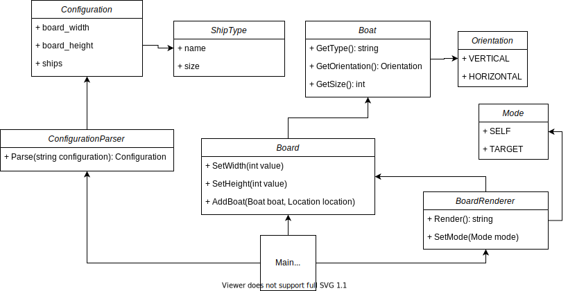

# Advanced Programming 2 - Battleships
##  1. Challenge Outline
### Summary & Overview
The battleships challenge is to create a command-line version of the
famous battleships game. The grid is printed on the console, using
numbers to indicate the rows, letters to indicate the columns (A - Z,
then AA - ZZ, etc. for longer column grids), and also letters to
represent ships on the board (for example, a submarine is 3 S letters
in a row).

The game should load the board size and the types of ships from a
configuration file. For example, here is the default configuration:
```
Board: 10x10
Boat: Carrier, 5
Boat: Battleship, 4
Boat: Destroyer, 3
Boat: Submarine, 3
Boat: Patrol Boat, 2
```
The board is limited to a max size of 80x80.

An example board based on the above configuration looks like this:
```
   A B C D E F G H I J
1                     
2  C               D  
3  C               D  
4  C               D  
5  C                  
6  C       B B B B    
7                     
8                     
9      S S S       P  
10                 P  
```

In a standard game, there will be two players. Each player can see
their own board (the player's board) and the enemy's board (the target
board), which should not display the ship positions.

The game must also include a computer player for single-player
gameplay.

Furthermore, players must be able to place ships, have ships
auto-placed, target specific locations on the board, see hits and
misses, support a turn-based play system, and (for merit and
distinction) support the "salvo" game mode (where each ship can fire a
torpedo in each round) and the "hidden mines" game mode (where hitting
a mine will cause an explosion in adjacent fields).

### Proposed Solution
My proposed solution consists of four parts:
1. Configuration parser
   
   The configuration parser will read configuration files and create
   a configuration object from these.
1. Board
   
   The board will contain all of the logic for placing and targeting
   ships. Furthermore, when mines are implemented, it will also hold
   mines. It will perform logic checks for board out of bounds
   placement and placing ships on top of eachother. Lastly, it will
   also be able to auto-place ships.
1. Board renderer
   
   The board renderer is a component that takes a board and then
   renders this as a string to print to the console. Various settings
   can be applied to the board renderer, which will allow us to print
   all possible variations of a board. For example, the renderer can
   be put into a TARGET state, where you can only see where you have
   hit and not the enemy's actual ship locations. If put into a SELF
   state, you can see all of your ships and where they have been hit.
1. Main

   The main component will contain user interaction (input/output),
   initialization of each of the other components, and commands which
   trigger the gameplay.
   
   The main component will:
   1. Use the configuration parser to read a file, and report any
      errors. If there are errors, the default file will be loaded
      instead.
   2. Create a board given the configuration, and forward any user
      commands (e.g. place ship) to the board, which will trigger
      the remaining logic.
   3. Use the board renderer to print the user's board on each turn.

## UML Diagram


## Initial Working Plan
### Overall Approach
The overall approach with this project is to test each component.
For this purpose, the GoogleTest library is included in this project
(cloned from https://github.com/google/googletest into
`lib/googletest`). I will use make to compile the program during
development, hence the `CMakeLists.txt` files in each source directory.

### Development Strategy
Each component will be developed independently and tested. For this
purpose, there exist four test files in the `test/` directory that
can be inspected:
1. `configuration-parser-test.cc`
1. `board-renderer-test.cc`
1. `board-test.cc`

The remaining main component will be tested manually, as given the
rest of the components work correctly proved by tests, the main
component is a minimum amount of work. Testing the main component
would mean that logic is tested twice, which is not useful in a real
project because you end up maintaining twice as many tests for no added
value.

### Approach to Quality
Quality will be ensured by writing a test suite that covers a
reasonable variety of situations. I will test standard inputs,
borderline but valid inputs, and invalid inputs.

For the main component, a final run of the game will be done prior
to submission.

## Decomposition into Epics
Based on the above discussion, each component will be an epic:
- Epic 1: configuration parser
- Epic 2: board renderer
- Epic 3: board
- Epic 4: main component

Epics 1 - 3 may be completed in any order. Epic 4 relies on epics
1 - 3, so it can be developed alongside but not before any of the other
epics.

## Object-Oriented Design Ideas and Phased Breakdown
Epics 1 - 3 will be classes. They will use state for logic and
configuration. For example, the board renderer will have state that
dictates how the board is rendered (as a target board or a self board).

Each component may introduce as many further classes as required to
make it work neatly. For example, the board class may (or may not)
need a class to store boats based on their locations. These further
classes will be broken down as I go along, as they are difficult
to plan beforehand.

Epic 4 will just be the main method, and will instantiate each of
the other epics, and provide their dependencies. It will also deal
with user input and output.